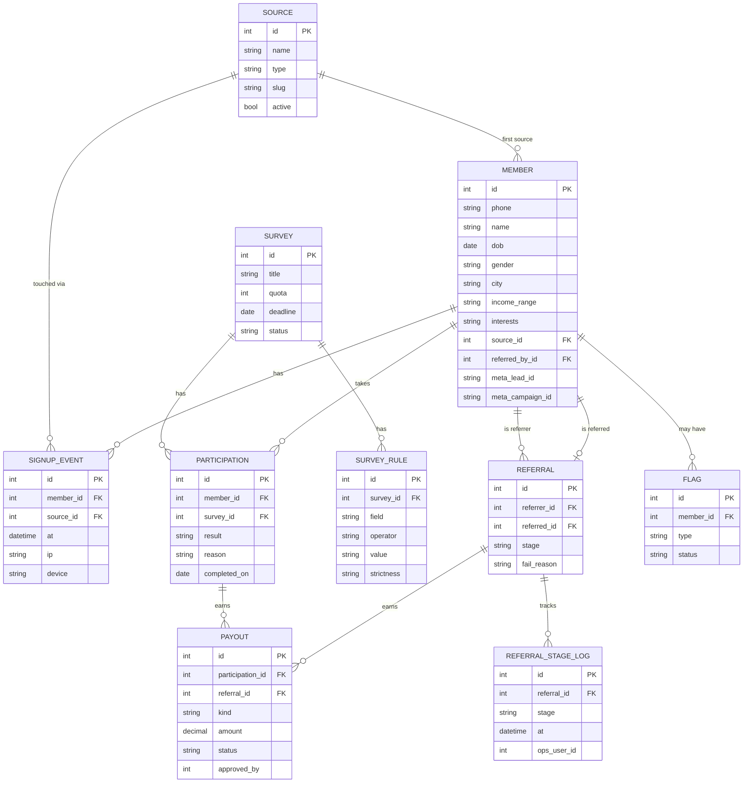

```mermaid
erDiagram
    SOURCE ||--o{ MEMBER : "first source"
    SOURCE ||--o{ SIGNUP_EVENT : "touched via"
    MEMBER ||--o{ SIGNUP_EVENT : has
    MEMBER ||--o{ REFERRAL : "is referrer"
    MEMBER ||--o| REFERRAL : "is referred"
    SURVEY ||--o{ SURVEY_RULE : has
    SURVEY ||--o{ PARTICIPATION : has
    MEMBER ||--o{ PARTICIPATION : takes
    REFERRAL ||--o{ REFERRAL_STAGE_LOG : tracks
    MEMBER ||--o{ FLAG : "may have"
    PARTICIPATION ||--o{ PAYOUT : earns
    REFERRAL ||--o{ PAYOUT : earns

    SOURCE {
        int id PK
        string name
        string type
        string slug
        bool active
    }
    MEMBER {
        int id PK
        string phone
        string name
        date dob
        string gender
        string city
        string income_range
        string interests
        int source_id FK
        int referred_by_id FK
        string meta_lead_id
        string meta_campaign_id
    }
    SIGNUP_EVENT {
        int id PK
        int member_id FK
        int source_id FK
        datetime at
        string ip
        string device
    }
    SURVEY {
        int id PK
        string title
        int quota
        date deadline
        string status
    }
    SURVEY_RULE {
        int id PK
        int survey_id FK
        string field
        string operator
        string value
        string strictness
    }
    PARTICIPATION {
        int id PK
        int member_id FK
        int survey_id FK
        string result
        string reason
        date completed_on
    }
    REFERRAL {
        int id PK
        int referrer_id FK
        int referred_id FK
        string stage
        string fail_reason
    }
    REFERRAL_STAGE_LOG {
        int id PK
        int referral_id FK
        string stage
        datetime at
        int ops_user_id
    }
    FLAG {
        int id PK
        int member_id FK
        string type
        string status
    }
    PAYOUT {
        int id PK
        int participation_id FK
        int referral_id FK
        string kind
        decimal amount
        string status
        int approved_by
    }
```
