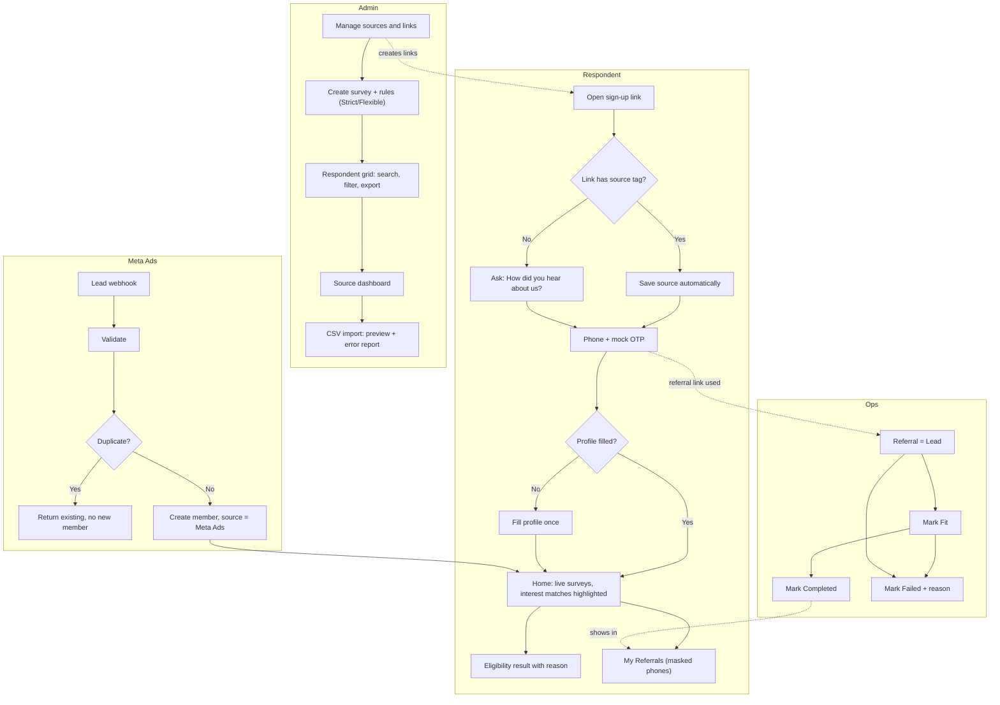

```mermaid
flowchart TD
    subgraph R["Respondent"]
        R1["Open sign-up link"] --> R2{"Link has source tag?"}
        R2 -->|Yes| R3["Save source automatically"]
        R2 -->|No| R4["Ask: How did you hear about us?"]
        R3 --> R5["Phone + mock OTP"]
        R4 --> R5
        R5 --> R6{"Profile filled?"}
        R6 -->|No| R7["Fill profile once"]
        R6 -->|Yes| R8["Home: live surveys, interest matches highlighted"]
        R7 --> R8
        R8 --> R9["Eligibility result with reason"]
        R8 --> R10["My Referrals (masked phones)"]
    end

    subgraph A["Admin"]
        A1["Manage sources and links"] --> A2["Create survey + rules (Strict/Flexible)"]
        A2 --> A3["Respondent grid: search, filter, export"]
        A3 --> A4["Source dashboard"]
        A4 --> A5["CSV import: preview + error report"]
    end

    subgraph O["Ops"]
        O1["Referral = Lead"] --> O2["Mark Fit"]
        O2 --> O3["Mark Completed"]
        O2 --> O4["Mark Failed + reason"]
        O1 --> O4
    end

    subgraph M["Meta Ads"]
        M1["Lead webhook"] --> M2["Validate"]
        M2 --> M3{"Duplicate?"}
        M3 -->|Yes| M4["Return existing, no new member"]
        M3 -->|No| M5["Create member, source = Meta Ads"]
    end

    R5 -.->|"referral link used"| O1
    A1 -.->|"creates links"| R1
    M5 --> R8
    O3 -.->|"shows in"| R10
```
